<h2 align="center" style="color:#38c2bb;">📚 BrainPress</h2>

  <a href="https://github.com/cp-psource/brainpress/discussions" style="color:#38c2bb;">💬 Forum</a>
  <a href="https://github.com/cp-psource/brainpress/releases" style="color:#38c2bb;">⬇️ Download</a>
  <a href="themes.html" style="color:#38c2bb;">🎨 Design</a>
  <a href="readme-en.html" style="color:#38c2bb;">🌐 English</a>

## Denkst Du darüber nach, Tutorials oder Kurse auf Deiner Webseite zu teilen oder zu verkaufen? Erstelle, bewerbe und verkaufe ganz einfach Dein Wissen mit BrainPress.

### Einfaches Online-Lernen

BrainPress macht Online-Lernen einfach mit Kursseiten, Paywalls, Social Sharing und einer interaktiven Lernumgebung, die dabei hilft, mehr Studenten miteinander zu verbinden.

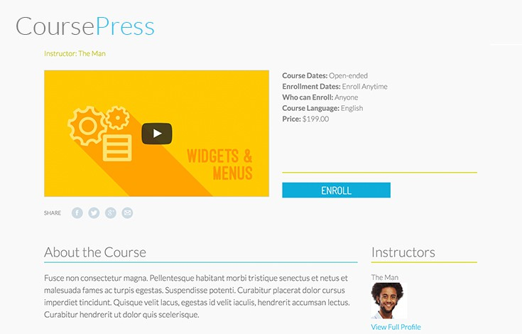

  Gestalte Deine Kurse interaktiv mit Video, Audio, Quiz und anderen herunterladbaren Medien.

 

### Flexibler Stil

BrainPress wird mit einem eigenen Theme geliefert – gestaltet und sofort einsatzbereit. Darüber hinaus erleichtern die enthaltenen Shortcodes und Widgets die Integration von BrainPress in Deine Lieblingsthemes.

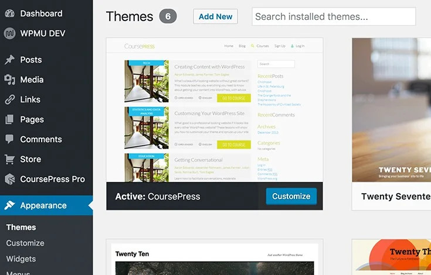

  Verwende das BrainPress-Design für vollständig gestaltete Einheiten direkt nach dem Auspacken.

### Medien und interaktives Lernen

 

   Bette Video-, Audiodateien und Bilder ein, teile herunterladbare Projektdateien, erstelle Quizfragen, ermögliche Studenten, Kursarbeiten einzureichen und an Gruppendiskussionen teilzunehmen.

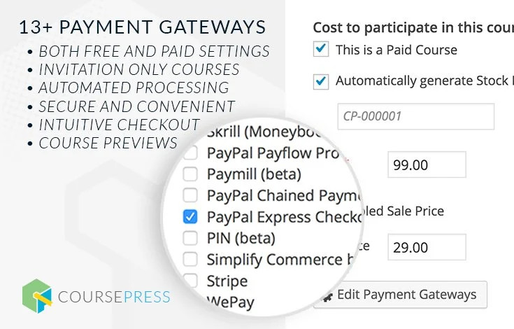

  Durch die Integration von MarketPress und WooCommerce kannst Du Deine Kurse über jedes der über 100 Zahlungsgateways verkaufen.

### MarketPress & WooCommerce

Erstelle und verwalte die nächste große Academy, Tuts+ oder Lynda mit integriertem MarketPress und WooCommerce. Beginne mit der Annahme von Zahlungen mit einer der über 100 verfügbaren Zahlungsoptionen.

 

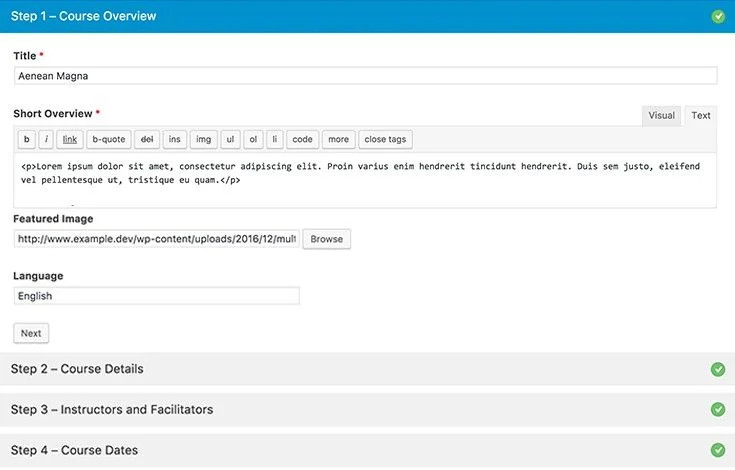

  BrainPress erleichtert die Einrichtung und Verwaltung von Schülern, Kursen und Lehrern.

### Verwalte Dein Klassenzimmer wie ein Profi

Verwalte Studenten, Dozenten und Kurse wie ein Profi mit automatischer Benotung und Berichterstattung, Beurteilungen und Diskussionen. Mit BrainPress können Studenten ihre Fortschritte von Anfang bis Ende verfolgen.

 

### Erinnerungen und Benachrichtigungen

Tropffreisetzungseinheiten und Versenden von Benachrichtigungen, wenn neues Material verfügbar ist. Automatisierte und anpassbare Benachrichtigungen helfen sowohl Schülern als auch Lehrern, den Überblick über die Kommunikation zu behalten.

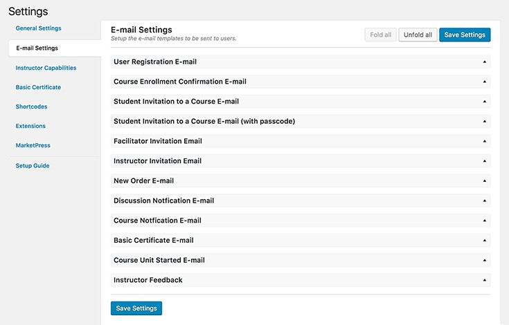

  Schreibe benutzerdefinierte Folge-E-Mail-Benachrichtigungen.

 

### Weitere Möglichkeiten zum Moderieren

Stelle sicher, dass jede Frage beantwortet wird und die Aufgaben schnell bewertet werden – auch in den großen Kursen. Füge mehrere Dozenten und Kursleiter hinzu, um den Überblick über die Antworten zu behalten.

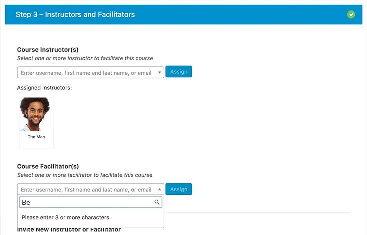

  Weise mehrere Moderatoren und Dozenten zu, die Deine Schüler unterstützen.

   

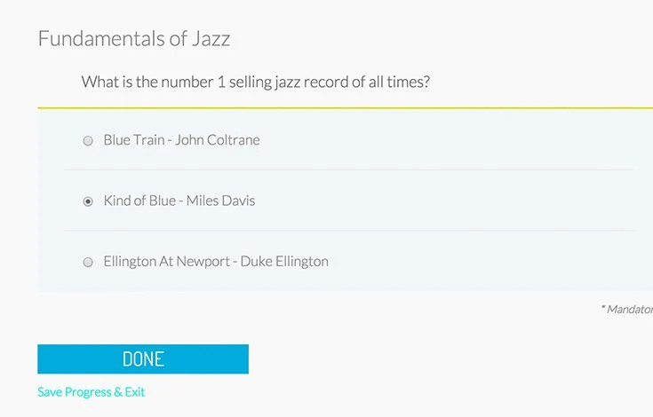

  Erstelle alle Arten von Quizzen mit Mehrfachantworten, Einzelauswahl, Upload und auswählbaren Modulen.

### Weitere Quizoptionen

BrainPress bietet mehr Möglichkeiten zur Bewertung Deiner Schüler: Mehrfachantwort, Einzelauswahl, auswählbare Antwort, kurze Antwort, lange Antwort, Richtig/Falsch und Hochladen. Fordere außerdem die Schüler auf, jede Quizeinheit mit einer qualifizierenden Note zu absolvieren, bevor sie mit der nächsten Sitzung beginnen.

 

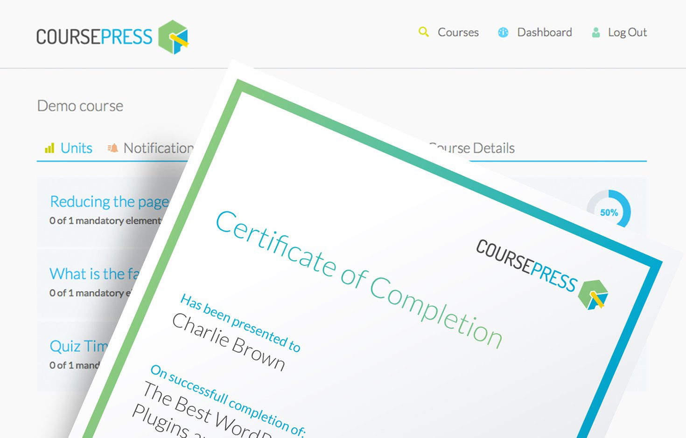

  Erstelle individuelle Zertifikate für jeden Kurs.

### Benutzerdefinierte Abschlusszertifikate

Mit BrainPress kannst Du für jeden Kurs individuell gestaltete, personalisierte, druckbare Abschlusszertifikate erstellen.

### All-In-One-LMS

 

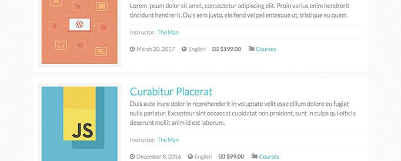

   BrainPress ist das komplette Learning Management System (LMS), das von Profis für Profis entwickelt wurde. Der Wissensaustausch war noch nie so einfach.

## Verwendung

### So startest Du:

Melde Dichich bei Deinem Admin-Panel für ClassicPress oder Multisite an und aktiviere das Plugin:

* Bei regulären ClassicPress-Installationen – besuche „Plugins“ und aktiviere das Plugin.
* Für ClassicPress-Multisite-Installationen – Aktiviere es Blog für Blog (z.B. wenn Du es zu einem Premium-Plugin für PS Bloghosting machen möchtest) oder besuche Netzwerkadministrator -> Plugins und Netzwerk. Aktiviere das Plugin.

### Benutzen:

Nach der Installation und Aktivierung wird in Deinem Dashboard ein neuer Menüpunkt angezeigt. _BrainPress_.

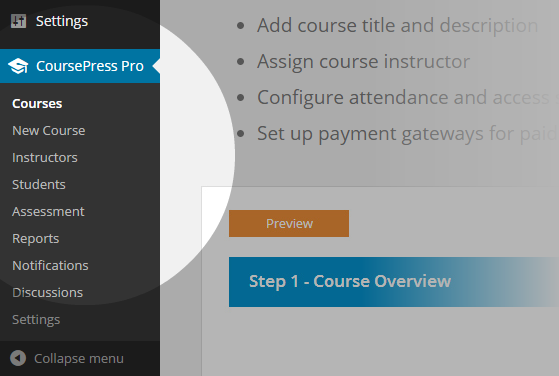

  Wenn Du auf diesen Menülink klickst, wirst Du mit einer Willkommensnachricht und kurzen Details begrüßt, die Dir den Einstieg in die Kurserstellung erleichtert.

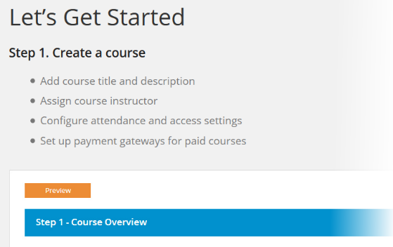

### Einen neuen Kurs hinzufügen

Beginnen wir mit dem Hinzufügen eines Kurses. Gehe zu _BrainPress > Neuer Kurs_.

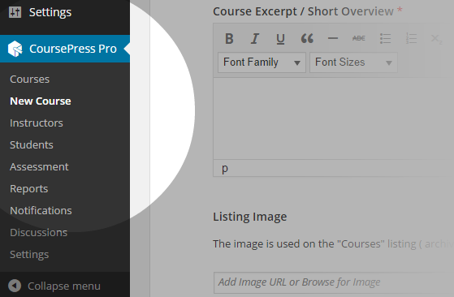

  Du siehst eine Reihe von Unterabschnitten, die einen 6-stufigen Prozess umfassen. Gehen wir sie alle durch.

##### Step 1 - Course Overview

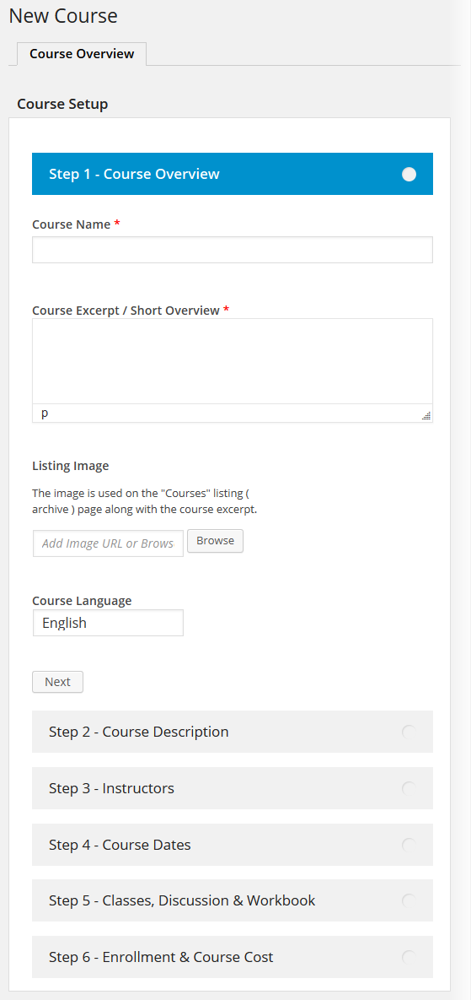

*   Enter a _Course Name_.
*   Enter a _Course Excerpt_, or a short overview of the course.
*   Optionally, upload or link to an _Listing Image_ to be used for the course display in the front-end.
*   Enter a _Course Language_.
*   Click the _Next_ button to continue to the next step.

##### Step 2 - Course Description

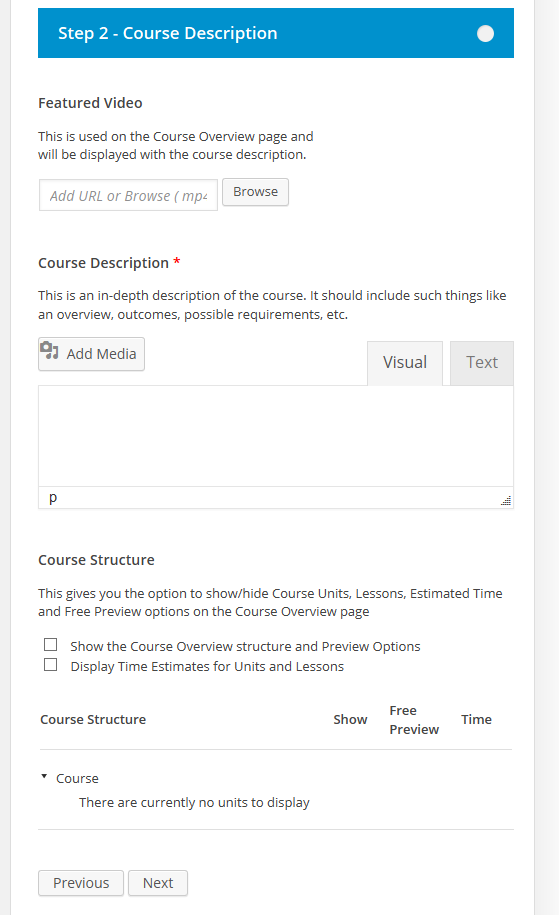

*   Optionally, you can upload or link to a _Featured Video_, to be displayed when users view the course details in the Course Overview page.
*   Enter a _Course Description_, a detailed description of the course. You'll have the full power of the ClassicPress visual editor for customizing the description.
*   In the _Course Structure_ section, you'll have options for customizing the course structure. You'll also see a list of units, which will be empty initially. You'll be able to add and edit units later.
*   Tick the '_Show the Course Overview structure and Preview Options_' to display the units listing in the Course Overview page. This information will otherwise only be available for students enrolled in the course.
*   Tick the '_Display Time Estimates for Units and Lessons_' to show a time estimate option when editing the units.
*   Click the _Previous_ button to go back to the previous section or the _Next_ button to continue to the next step.

##### Step 3 - Instructors

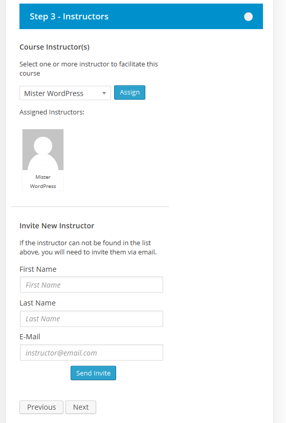

*   You can assign as many instructors as you like in the _Course Instructors_ section. You'll be able to choose from any of the users in your standard ClassicPress Users list.
*   Easily send an email invite through the _Invite New Instruction_ section. Simply enter a _First Name_, _Last Name_ and _E-Mail_ address then press _Send Invite_.
*   Click the _Previous_ button to go back to the previous section or the _Next_ button to continue to the next step.

##### Step 4 - Course Dates

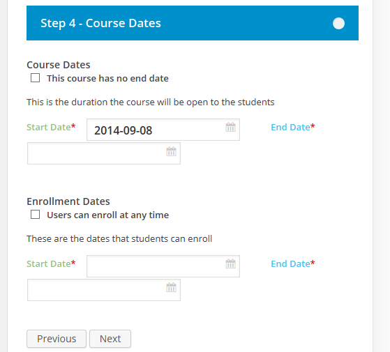

*   Enter the dates your course will be available within the _Course Dates_ section. Or tick the '_This course has no end date_' option.
*   Otherwise you can select the _Start Date_ and _End Date_ using the pop-up date picker.
*   Similarly, in the _Enrollment Dates_ section, tick the '_Users can enroll at any time_' option to allow enrollment any time.
*   Otherwise you can again select the _Start Date_ and _End Date_ using the pop-up date picker.
*   Click the _Previous_ button to go back to the previous section or the _Next_ button to continue to the next step.

##### Step 5 - Classes, Discussions and Workbooks

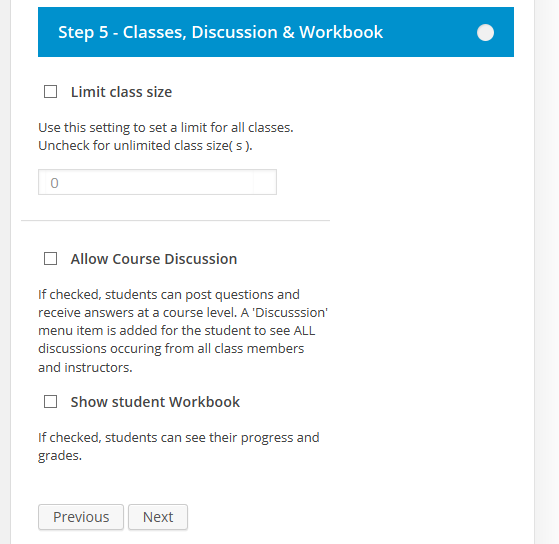

*   To limit the class size, tick the '_Limit class size_' option end enter a value for the limit.
*   Tick the '_Allow Course Discussion_' option to allow open discussion between students and instructors.
*   Tick the '_Show student Workbook_' option to allow students to see their progress.
*   Click the _Previous_ button to go back to the previous section or the _Next_ button to continue to the next step.

##### Step 6 - Enrollment and Course Cost

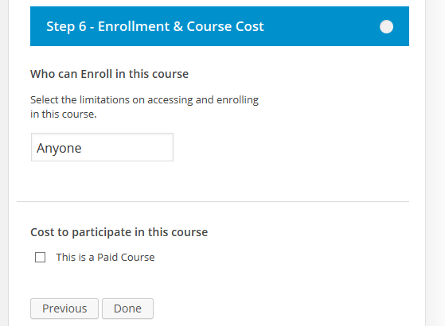

 Tick the '_This is a Paid Course_' option to display payment options. For payments, BrainPress Pro integrates with both [MarketPress](https://cp-psource.github.io/marketpress/ "MarketPress ClassicPress e-Commerce") and [WooCommerce](https://wordpress.org/plugins/woocommerce/). Please note that currently, only one of them (either MarketPress or WooCommerce) should be activated, activating both at the same time may cause conflicts. For MarketPress integration, the first time the above payment option is selected, you'll be presented with a message about MarketPress, like so: 

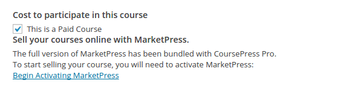

 Click the _Begin Activating MarketPress_ link to begin the MarketPress activation process and expose the payment options. Or for WooCommerce integration, simply ensure that WooCommerce is installed and activated, then tick the '_Use WooCommerce to sell courses_' setting at _BrainPress Pro > Settings_. You can optionally select to redirect WooCommerce product posts to a parent course as well. 

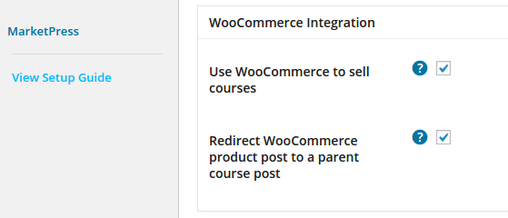

 WooCommerce settings at BrainPress Pro > Settings

   With either MarketPress or WooCommerce installed and activated, and with the settings configured as above, you'll then see payment options for your Course. 

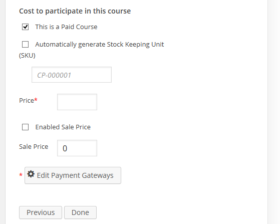

*   Tick the '_Automatically generate Stock Keeping Unit_' option to have BrainPress Pro automatically create a unique SKU. Otherwise you can enter a _SKU_ value yourself.
*   Enter the _Price_.
*   Tick the '_Enabled Sale Price_' option to specify that this course on sale.
*   Enter a _Sale Price_ to be used with the above option.
*   If you're using MarketPress, you'll have an option to _Edit Payment Gateways_ where you'll be presented with a pop-up dialog and will be able to select and configure the payment gateways.

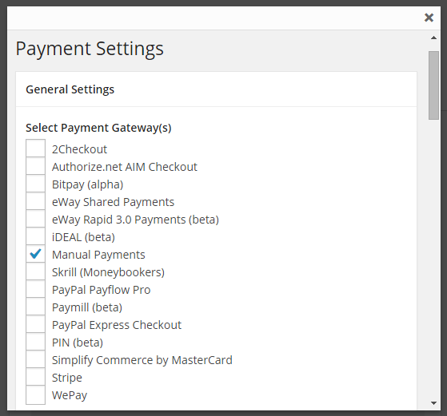

 Once you're done configuring the payment settings, you can click the _Previous_ button to go back to the previous section. Or click the _Done_ button to complete the course creation process and save the new course.

### Courses

Let's have a look through the Courses at _BrainPress Pro > Courses_. 

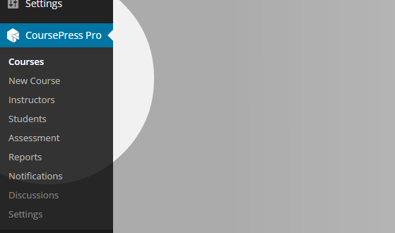

 You'll see a list of all the Courses you've created. 

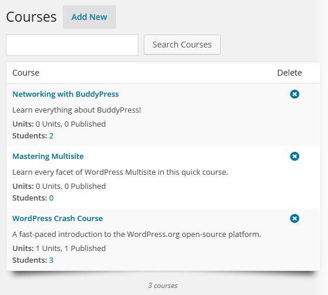

*   User the _Search Courses_ section to search through the existing courses.
*   Click the _Delete_ icon to delete a course.
*   Clicking the name of the course will take you to the edit section for the course. And clicking the Students link will take you to the Students tab of the edit page.

On wide-screen devices, you'll see a few extra options in the list. 

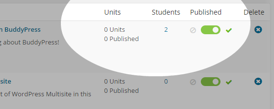

 You'll see a _Published_ column where you can easily publish or unpublish a course. 

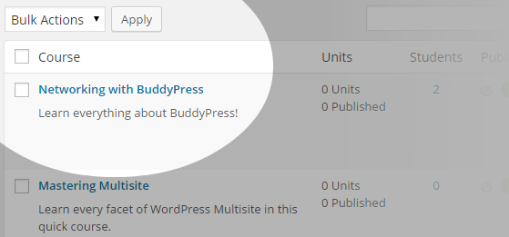

 You'll also see a Bulk Actions drop-down. You can tick any courses in the list, select an option from the drop-down and click Apply to apply an action to all the ticked courses. The available Bulk Actions are as follows:

*   Publish
*   Unpublish
*   Delete

You can also hover your mouse over any course in the list to see a quick list of links. 

 Those links are as follows:

*   _Edit_ - quickly get to the Course Overview page for this course
*   _Units_ - go to the Units page
*   _Students_ - go to the Students tab
*   _View Course_ - view the course in the site's front-end
*   _View Units_ - view the units through the site's front-end

Let's have a look at the Course Overview for the course we created earlier by clicking the _Edit_ link.

##### Course Overview

Here, you'll see a number of tabs (_Course Overview_, _Units_ and _Students_) along with some other options. 

*   You'll see an accordion list of the various _Steps_ created earlier. Click on any of them to expose the settings for each.
*   Quickly publish the course using the _Publish Course_ switch.
*   Click the _Preview_ button to see a preview of the Course in the site's front-end.

Let's go to the Students tab.

##### Students

The _Students_ tab lets you quickly access the Students for this Course. 

*   Easily add a student by selecting a name from the drop-down selector then pressing the _Add Student_ button.
*   Click the _Withdraw_ icon to withdraw a Student from the course.
*   Quickly invite a Student to this Course using the '_Invite a Student section_'. Enter a _First Name_, _Last Name_ and a valid _E-Mail_ address, then press _Invite_.
*   Clicking on the _Profile_ icon will take you to a Student Profile page for the selected Student.

##### Student Profile

 Here, you'll see some basic details about the Student along with some helpful links and a list of Courses the Student is enrolled in.

*   Quickly email the Student by clicking their _Email_ address.
*   Click the _Edit_ icon to edit this Student's user account.
*   Click the _View Workbook_ button to go to the view this Student's Workbook. We'll go into more detail on this below.
*   Click the Course title or the _Edit_ link next to it to go to the Course Overview page for the selected Course.
*   Take a look at this Course through the site's front-end by clicking the arrow icon.

Let's go back and have a look at the Units tab.

##### Units

Units are the actual content of the Course. Lets go through the various options for adding and editing them. 

 You'll see a list of existing _Units_ which you can click to edit the settings for. Hovering your mouse over a Unit will display an arrow icon to indicate you can drag it. You can re-order the Units by dragging and dropping them into place by this means. 

 Hover your mouse over a Course, then drag and drop to re-order it.

 Click the _Add New Unit_ button to add a Unit. 

 In the upper right corner of this tab, you'll see a _Publish Course_ toggle switch that can be used to quickly publish/unpublish the Course. Below this, you'll see a number of sub-sections for editing the Unit.

##### Unit Settings

*   Use the toggle switch in the upper right to switch the Unit to _Draft_ or _Live_ mode.
*   Enter a title in the _Unit Title_ field.
*   Enter a date for the _Unit Availability_. A drop-down selector will display to let you easily select a date.
*   Tick the '_User needs to complete current unit in order to access the next one_' option to require the Student to complete this Unit before progressing.
*   Click the _Save_ button to save your changes and the _Preview_ button to preview the Unit in your site's front-end.
*   Click the _Delete Unit_ icon to delete this Unit.

##### Unit Pages

Pages can be used to separate sections of Unit content. 

*   Select a Page by clicking one of the _Page numbers_.
*   Add a Page by clicking the _+_ icon.
*   Click the _Delete Page_ button to delete the selected Page.
*   Enter a name for the Page in the _Page Label_ field.
*   Tick the '_Show page label on unit_' option to have this Page's label displayed when Students view the Page in the front-end.

##### Build Page

This sub-section provides a number of elements you can use to build the Page. 

 Simply click any of the element icons and you'll see a sub-section added below that you can use to configure the settings. Let's take a quick look through each.

*   _Text_ - used for basic text information

*   _Image_ - for adding images

*   _Video_ - to add video content

*   _File Download_ - to provide a file for Students to download

*   _Section Break_ - to visually separate sections

*   _Multiple choice_ - easily add a multiple-choice quiz

*   _File Upload_ - allows Students to upload a file for the Instructor

*   _Single Choice_ - create a single-choice quiz for Students

*   _Answer Field_ - ask a question and provide a single or multiple line field for Students to answer.

 At the bottom of the page bottom, you'll see a couple more buttons and another toggle switch. 

*   Click the _Save_ button to Save your changes to the Unit.
*   Click the _Preview_ button to take a look at the Unit in the site's front-end.
*   Use the toggle switch to change to _Draft_ or _Live_ mode.

### Instructors

Courses need instructors so lets see how to add and edit them at _BrainPress Pro > Instructors_. 

 Here, you'll find a list of all the Instructors you've configured. Instructors are basically ClassicPress users who are designated as Instructors for a course. 

*   You can easily search through the Instructors using the _Search Instructors_ section.
*   Click the 'Add New' button to add a new _Instructor_. This will take you to the _Users > Add New_ page in ClassicPress, where you'll be able to add new users.
*   Click the Delete option to delete a particular _Instructor_.

When viewing on wide screen devices, you'll be also see a Bulk Actions drop-down. 

 To utilize _Bulk Actions_, simply tick the Instructors you'd like to edit, select one of the actions from the drop-down and click _Apply_. The Bulk Actions available are as follows:

*   Delete
*   Unassign from all courses

Clicking the Profile option will take you to the Instructor's profile page. 

 You'll see a list of all the _Courses_ the Instructor is associated with along with links to each. 

 You'll also see a small Profile section with additional details and an '_Edit Profile_' link to go to the user editor page for this Instructor's user account.

### Students

Courses also need students, so lets see how to add and edit them at _BrainPress Pro > Students_. 

 Here, you'll find a list of all the Students listed in the system configured. Students are basically any ClassicPress user who is enrolled in a course. 

*   You can easily search through the Students using the _Search Students_ section.
*   Click the '_Add New_' button to add a new Student. This will take you to the _Users > Add New_ page in ClassicPress, where you'll be able to add new users.
*   Click the _Delete_ option to delete a particular _Student_.

When viewing on wide screen devices, you'll be also see a Bulk Actions drop-down. 

 To utilize _Bulk Actions_, simply tick the Students you'd like to edit, select one of the actions from the drop-down and click _Apply_. The Bulk Actions available for Students are as follows:

*   Delete
*   Withdraw from all courses

Clicking the _Profile_ option will take you to the Student's profile page. You'll see a list of all the _Courses_ the Student is enrolled in along with links to each. You'll also see a small Profile section with additional details and an '_Edit Profile_' link to go to the user editor page for this Student's user account.

### Settings

Let's go through the plugin's settings at _BrainPress Pro > Settings_. 

 Here's you'll see a number of sub-sections for customizing various aspects of the plugin. 

 Let's take a look at these sub-sections, starting with the General settings.

##### General

The General settings includes several sub-sections itself, the first being for options to customize the url slugs. 

 The slugs available for customization, along with default values, are as follows:

*   _Course Slug_ http://yoursite.com/_courses_/
*   _Units Slug_ http://yoursite.com/my-course/_units_/
*   _Course Notifications Slug_ http://yoursite.com/my-course/_notifications_/
*   _Course Discussions Slug_ http://yoursite.com/my-course/_discussion_/
*   _Course New Discussions Slug_ http://yoursite.com/my-course/discussion/_add_new_discussion_/
*   _Course Grades Slug_ http://yoursite.com/my-course/_grades_/
*   _Course Workbook Slug_ http://yoursite.com/my-course/_workbook_/
*   _Enrollment Process_ page http://yoursite.com/_enrollment-process_/
*   _Login page_ http://yoursite.com/_student-login_/
*   _Sign Up page_ http://yoursite.com/_courses-signup_/
*   _Student Dashboard page_ http://yoursite.com/_courses-dashboard_/
*   _Student Settings page_ http://yoursite.com/_settings_/
*   _Instructor profile slug_ http://yoursite.com/_instructor_/

Further down the page, you'll see additional settings. 

 Adjust the settings as you need and press the _Save Changes_ button to save.

##### E-Mail Settings

Through the E-Mail Settings sub-section, you can customize the contents of the notification e-mails used by the plugin. 

 The following are the various e-mails you can configure, along with codes you can use within the content to provide dynamic values:

*   _User Registration E-mail_ - codes available: STUDENT_FIRST_NAME, BLOG_NAME, LOGIN_ADDRESS, COURSES_ADDRESS, WEBSITE_ADDRESS
*   _Course Enrollment Confirmation E-mail_ - codes available: STUDENT_FIRST_NAME, BLOG_NAME, LOGIN_ADDRESS, COURSES_ADDRESS, WEBSITE_ADDRESS, COURSE_ADDRESS
*   _Student Invitation to a Course E-mail_ - codes available: STUDENT_FIRST_NAME, COURSE_NAME, COURSE_EXCERPT, COURSE_ADDRESS, WEBSITE_ADDRESS
*   _Student Invitation with a Passcode to a Course E-mail_ - codes available: STUDENT_FIRST_NAME, COURSE_NAME, COURSE_EXCERPT, COURSE_ADDRESS, WEBSITE_ADDRESS, PASSCODE
*   _Instructor Invitation E-mail_ - codes available: INSTRUCTOR_FIRST_NAME, INSTRUCTOR_LAST_NAME, INSTRUCTOR_EMAIL, CONFIRMATION_LINK, COURSE_NAME, COURSE_EXCERPT, COURSE_ADDRESS, WEBSITE_ADDRESS, WEBSITE_NAME

Be sure to press the _Save Changes_ button when you're done making changes. 

##### Instructor Capabilities

Instructors have special capabilities to allow them to create Courses. Let's have a look through those capabilities. 

 Capabilities are divided into sub-sections, as follows: _General_

*   Access to plugin menu
*   Access to the Courses menu item
*   Access to the Intructors menu item
*   Access to the Students menu item
*   Assessment
*   Reports
*   Notifications
*   Access to the Settings menu item

_Courses_

*   Create new courses
*   Update any assigned course
*   Update courses made by the instructor only
*   Delete any assigned course
*   Delete courses made by the instructor only
*   Change status of any assigned course
*   Change status of courses made by the instructor only

_Units_

*   Create new course units
*   View units in every course ( can view from other Instructors as well )
*   Update any unit (within assigned courses)
*   Update units made by the instructor only
*   Delete any unit (within assigned courses)
*   Delete course units made by the instructor only
*   Change status of any unit (within assigned courses)
*   Change statuses of course units made by the instructor only

_Instructors_

*   Assign instructors to any course
*   Assign instructors to courses made by the instructor only

_Students_

*   Invite students to any course
*   Invite students to courses made by the instructor only
*   Withdraw students from any course
*   Withdraw students from courses made by the instructor only
*   Add students to any course
*   Add students to courses made by the instructor only
*   Add students to courses assigned to the instructor only
*   Add new users with Student role to the blog
*   Send bulk e-mail to students
*   Send bulk e-mail to students within a course made by the instructor only
*   Delete Students (deletes ALL associated course records)

_Notifications_

*   Create new notifications
*   Create new notifications for courses created by the instructor only
*   Create new notifications for courses assigned to the instructor only
*   Update every notification
*   Update notifications made by the instructor only
*   Delete every notification
*   Delete notifications made by the instructor only
*   Change status of every notification
*   Change statuses of notifications made by the instructor only

Simply tick the Capabilities you want to allow, then click the _Save Changes_ button to save. 

##### Shortcodes

BrainPress Pro provides scores of shortcodes that you can use within your site's content areas to provide plugin features as needed. 

 This page shows detailed information to help with the shortcodes but here's a list of all the shortcodes with some helpful info:

*   _Instructors List_ [course_instructors] Display a list or count of Instructors ( gravatar, name and link to profile page )
*   _Instructor Avatar_ [course_instructor_avatar] Display an instructor’s avatar.
*   _Instructor Profile URL_ [instructor_profile_url] Returns the URL to the instructor profile.
*   _Course Details_ [course] This shortcode allows you to display details about your course. Note: All the same information can be retrieved by using the specific course shortcodes following.
*   _Course Title_ [course_title] Displays the course title.
*   _Course Summary_ [course_summary] Displays the course summary/excerpt.
*   _Course Description_ [course_description] Displays the longer course description (post content).
*   _Course Start Date_ [course_start] Shows the course start date.
*   _Course End Date_ [course_end] Shows the course end date.
*   _Course Dates_ [course_dates] Displays the course start and end date range. Typically as [course_start] - [course_end].
*   _Course Enrollment Start_ [course_enrollment_start] Displays the course enrollment start date.
*   _Course Enrollment End_ [course_enrollment_end] Shows the course enrollment end date.
*   _Course Enrollment Dates_ [course_enrollment_dates] Displays the course enrollment start and end date range. Typically as [course_enrollment_start] - [course_enrollment_end].
*   _Coure Enrollment Type_ [course_enrollment_type] Shows the type of enrollment (manual, prerequisite, passcode or anyone).
*   _Course Class Size_ [course_class_size] Shows the course class size, limits and remaining seats.
*   _Course Cost_ [course_cost] Shows the pricing for the course or free for unpaid courses.
*   _Course Language_ [course_language] Displays the language of the course (if set).
*   _Course List Image_ [course_list_image] Displays the course list image. (See [course_media])
*   _Course Featured Video_ [course_featured_video] Embeds a video player with the course’s featured video. (See [course_media])
*   _Course Thumbnail_ [course_thumbnail] Shows the course thumbnail image that is generated from list image. (See [course_media])
*   _Course Media_ [course_media] Displays either the list image or the featured video (with the other option as possible fallback).
*   _Course Join Button_ [course_join_button] Shows the Join/Signup/Enroll button for the course. What it displays is dependent on the course settings and the user’s status/enrollment. See the attributes for possible button labels.
*   _Course Action Links_ [course_action_links] Shows "Course Details" and "Withdraw" links to students.
*   _Course Calendar_ [course_calendar] Shows the course calendar (bounds are restricted by course start and end dates). Will always attempt to show today’s date on a calendar first.
*   _Course List_ [course_list] Displays a listing of courses. Can be for all courses or restricted by instructors or students (only one or the other, if both specified only students will be used).
*   _Featured Course_ [course_featured] Shows a featured course.
*   _Course Structure_ [course_structure] Displays a tree view of the course structure.
*   _Course Signup/Login Page_ [course_signup] Shows a custom login or signup page for front-end user registration and login. Note: This is already part of BrainPress and can be set in BrainPress Settings. Links to default pages can be found in Appearance > Menus > BrainPress.
*   _Student Dashboard Template_ [courses_student_dashboard] Loads the student dashboard template.
*   _Student Settings Template_ [courses_student_settings] Loads the student settings template.

##### View Setup Guide

 This is just a quick link back to the welcome page, so you'll always have access to the 'Getting Started' section through this link.

### The BrainPress Pro Theme

BrainPress Pro works with any standard ClassicPress theme, but it also includes a built-in theme to help you get started. Lets switch to that theme at _Appearance > Themes_. 

 Locate the _BrainPress_ theme in the themes list. 

 Click the _Activate_ button to activate it!

### Widgets

BrainPress Pro also includes a number of widgets for use in your theme's sidebar areas, as follows:

*   _Featured Course_ - displays a featured Course

*   _Latest Courses_ - shows a list of recently published Courses

### The User Experience

Lets take a look at the front-end experience from the user's standpoint! Here's an example of how it could look with the BrainPress theme when viewing the front page. 

 Clicking the _Details_ link or the Course's image takes you to the Details page for the selected Course. 

