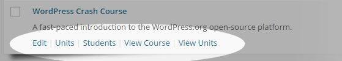
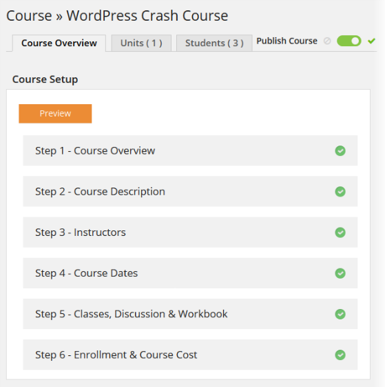
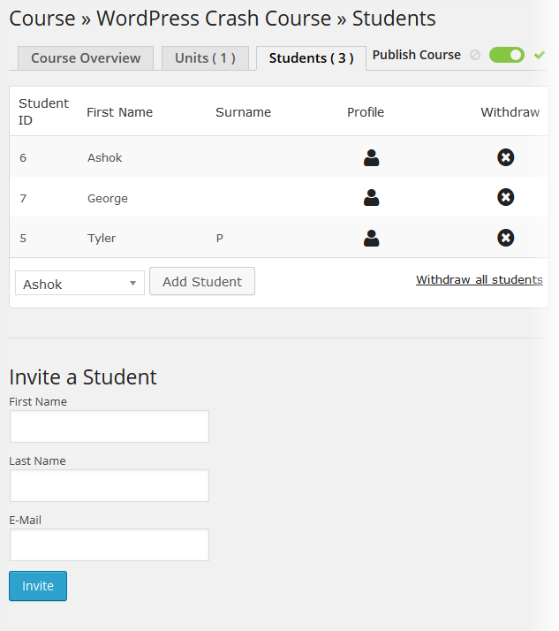
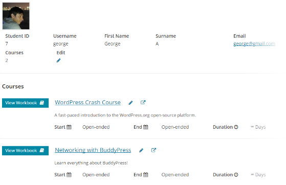
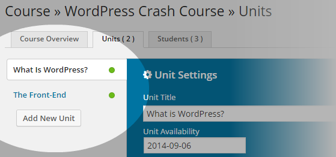
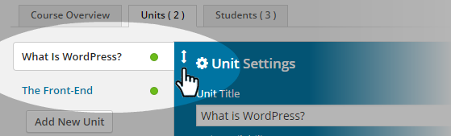
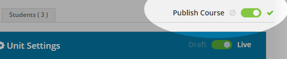
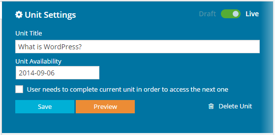
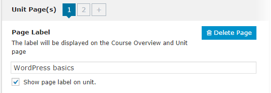

<h2 align="center" style="color:#38c2bb;">📚 BrainPress</h2>

  <a href="https://github.com/cp-psource/brainpress/discussions" style="color:#38c2bb;">💬 Forum</a>
  <a href="https://github.com/cp-psource/brainpress/releases" style="color:#38c2bb;">⬇️ Download</a>
  <a href="themes.html" style="color:#38c2bb;">🎨 Design</a>
  <a href="readme-en.html" style="color:#38c2bb;">🌐 English</a>

## Denkst Du darüber nach, Tutorials oder Kurse auf Deiner Webseite zu teilen oder zu verkaufen? Erstelle, bewerbe und verkaufe ganz einfach Dein Wissen mit BrainPress.

### Einfaches Online-Lernen

BrainPress macht Online-Lernen einfach mit Kursseiten, Paywalls, Social Sharing und einer interaktiven Lernumgebung, die dabei hilft, mehr Studenten miteinander zu verbinden.

  Gestalte Deine Kurse interaktiv mit Video, Audio, Quiz und anderen herunterladbaren Medien.

 

### Flexibler Stil

BrainPress wird mit einem eigenen Theme geliefert – gestaltet und sofort einsatzbereit. Darüber hinaus erleichtern die enthaltenen Shortcodes und Widgets die Integration von BrainPress in Deine Lieblingsthemes.

  Verwende das BrainPress-Design für vollständig gestaltete Einheiten direkt nach dem Auspacken.

### Medien und interaktives Lernen

 

   Bette Video-, Audiodateien und Bilder ein, teile herunterladbare Projektdateien, erstelle Quizfragen, ermögliche Studenten, Kursarbeiten einzureichen und an Gruppendiskussionen teilzunehmen.

  Durch die Integration von MarketPress und WooCommerce kannst Du Deine Kurse über jedes der über 100 Zahlungsgateways verkaufen.

### MarketPress & WooCommerce

Erstelle und verwalte die nächste große Academy, Tuts+ oder Lynda mit integriertem MarketPress und WooCommerce. Beginne mit der Annahme von Zahlungen mit einer der über 100 verfügbaren Zahlungsoptionen.

 

  BrainPress erleichtert die Einrichtung und Verwaltung von Schülern, Kursen und Lehrern.

### Verwalte Dein Klassenzimmer wie ein Profi

Verwalte Studenten, Dozenten und Kurse wie ein Profi mit automatischer Benotung und Berichterstattung, Beurteilungen und Diskussionen. Mit BrainPress können Studenten ihre Fortschritte von Anfang bis Ende verfolgen.

 

### Erinnerungen und Benachrichtigungen

Tropffreisetzungseinheiten und Versenden von Benachrichtigungen, wenn neues Material verfügbar ist. Automatisierte und anpassbare Benachrichtigungen helfen sowohl Schülern als auch Lehrern, den Überblick über die Kommunikation zu behalten.

  Schreibe benutzerdefinierte Folge-E-Mail-Benachrichtigungen.

 

### Weitere Möglichkeiten zum Moderieren

Stelle sicher, dass jede Frage beantwortet wird und die Aufgaben schnell bewertet werden – auch in den großen Kursen. Füge mehrere Dozenten und Kursleiter hinzu, um den Überblick über die Antworten zu behalten.

  Weise mehrere Moderatoren und Dozenten zu, die Deine Schüler unterstützen.

   

  Erstelle alle Arten von Quizzen mit Mehrfachantworten, Einzelauswahl, Upload und auswählbaren Modulen.

### Weitere Quizoptionen

BrainPress bietet mehr Möglichkeiten zur Bewertung Deiner Schüler: Mehrfachantwort, Einzelauswahl, auswählbare Antwort, kurze Antwort, lange Antwort, Richtig/Falsch und Hochladen. Fordere außerdem die Schüler auf, jede Quizeinheit mit einer qualifizierenden Note zu absolvieren, bevor sie mit der nächsten Sitzung beginnen.

 

  Erstelle individuelle Zertifikate für jeden Kurs.

### Benutzerdefinierte Abschlusszertifikate

Mit BrainPress kannst Du für jeden Kurs individuell gestaltete, personalisierte, druckbare Abschlusszertifikate erstellen.

### All-In-One-LMS

 

   BrainPress ist das komplette Learning Management System (LMS), das von Profis für Profis entwickelt wurde. Der Wissensaustausch war noch nie so einfach.

## Verwendung

### So startest Du:

Melde Dichich bei Deinem Admin-Panel für ClassicPress oder Multisite an und aktiviere das Plugin:

* Bei regulären ClassicPress-Installationen – besuche „Plugins“ und aktiviere das Plugin.
* Für ClassicPress-Multisite-Installationen – Aktiviere es Blog für Blog (z.B. wenn Du es zu einem Premium-Plugin für PS Bloghosting machen möchtest) oder besuche Netzwerkadministrator -> Plugins und Netzwerk. Aktiviere das Plugin.

### Benutzen:

Nach der Installation und Aktivierung wird in Deinem Dashboard ein neuer Menüpunkt angezeigt. _BrainPress_.

  Wenn Du auf diesen Menülink klickst, wirst Du mit einer Willkommensnachricht und kurzen Details begrüßt, die Dir den Einstieg in die Kurserstellung erleichtert.

### Einen neuen Kurs hinzufügen

Beginnen wir mit dem Hinzufügen eines Kurses. Gehe zu _BrainPress > Neuer Kurs_.

  Du siehst eine Reihe von Unterabschnitten, die einen 6-stufigen Prozess umfassen. Gehen wir sie alle durch.

##### Schritt 1 - Kursübersicht

*   Gib einen _Kursnamen_ ein.
*   Füge eine _Kurzbeschreibung_ des Kurses hinzu.
*   Optional: Lade ein _Listenbild_ hoch oder verlinke es, das für die Kursanzeige im Frontend verwendet wird.
*   Gib die _Kurssprache_ an.
*   Klicke auf den _Weiter_-Button, um zum nächsten Schritt zu gelangen.

##### Schritt 2 - Kursbeschreibung

*   Optional: Lade ein _Vorgestelltes Video_ hoch oder verlinke es, das auf der Kursdetailseite in der Kursübersicht angezeigt wird.
*   Gib eine _Kursbeschreibung_ ein – eine detaillierte Beschreibung des Kurses. Du kannst den visuellen Editor von ClassicPress voll nutzen, um die Beschreibung anzupassen.
*   Im Abschnitt _Kursstruktur_ kannst Du die Kursstruktur anpassen. Hier siehst Du auch eine Liste der Einheiten, die anfangs leer ist. Du kannst später Einheiten hinzufügen und bearbeiten.
*   Aktiviere die Option '_Kursübersichtsstruktur und Vorschauoptionen anzeigen_', um die Einheitenliste auf der Kursübersichtsseite anzuzeigen. Diese Informationen sind sonst nur für eingeschriebene Teilnehmer sichtbar.
*   Aktiviere die Option '_Zeitschätzungen für Einheiten und Lektionen anzeigen_', um eine Zeitschätzungsoption beim Bearbeiten der Einheiten einzublenden.
*   Klicke auf den _Zurück_-Button, um zum vorherigen Abschnitt zu gelangen, oder auf den _Weiter_-Button, um zum nächsten Schritt zu gelangen.

##### Schritt 3 - Dozenten

*   Du kannst im Abschnitt _Kursdozenten_ so viele Dozenten zuweisen, wie Du möchtest. Wähle einfach aus der Liste der Standard-ClassicPress-Benutzer aus.
*   Lade neue Dozenten ganz einfach per E-Mail ein. Gib im Abschnitt _Neuen Dozenten einladen_ einfach einen _Vorname_, _Nachname_ und eine _E-Mail-Adresse_ ein und klicke auf _Einladung senden_.
*   Klicke auf den _Zurück_-Button, um zum vorherigen Abschnitt zu gelangen, oder auf den _Weiter_-Button, um zum nächsten Schritt zu gelangen.

##### Schritt 4 - Kursdaten

*   Gib im Abschnitt _Kursdaten_ die Daten ein, an denen Dein Kurs verfügbar sein soll. Oder aktiviere die Option '_Dieser Kurs hat kein Enddatum_'.
*   Alternativ kannst Du das _Startdatum_ und _Enddatum_ mit dem Pop-up-Datumswähler auswählen.
*   Im Abschnitt _Einschreibedaten_ kannst Du ebenfalls die Option '_Benutzer können sich jederzeit einschreiben_' aktivieren, um eine Einschreibung jederzeit zu ermöglichen.
*   Alternativ kannst Du auch hier das _Startdatum_ und _Enddatum_ mit dem Pop-up-Datumswähler auswählen.
*   Klicke auf den _Zurück_-Button, um zum vorherigen Abschnitt zu gelangen, oder auf den _Weiter_-Button, um zum nächsten Schritt zu gelangen.

##### Schritt 5 - Klassen, Diskussionen und Arbeitsbücher

*   Um die Klassengröße zu begrenzen, aktiviere die Option '_Klassengröße begrenzen_' und gib einen Wert für die Begrenzung ein.
*   Aktiviere die Option '_Kursdiskussion erlauben_', um offene Diskussionen zwischen Studenten und Dozenten zu ermöglichen.
*   Aktiviere die Option '_Studenten-Arbeitsbuch anzeigen_', damit Studenten ihren Fortschritt sehen können.
*   Klicke auf den _Zurück_-Button, um zum vorherigen Abschnitt zu gelangen, oder auf den _Weiter_-Button, um zum nächsten Schritt zu gelangen.

##### Schritt 6 - Einschreibung und Kurskosten

Aktiviere die Option "_Dies ist ein kostenpflichtiger Kurs_", um Zahlungsoptionen anzuzeigen. Für Zahlungen integriert sich BrainPress Pro sowohl mit [MarketPress](https://cp-psource.github.io/marketpress/ "MarketPress ClassicPress e-Commerce") als auch mit [WooCommerce](https://wordpress.org/plugins/woocommerce/). Beachte bitte, dass derzeit nur eines der beiden Plugins (entweder MarketPress oder WooCommerce) aktiviert sein sollte, da die gleichzeitige Aktivierung beider Plugins zu Konflikten führen kann. 

Für die MarketPress-Integration wird dir beim ersten Aktivieren der oben genannten Zahlungsoption eine Nachricht zu MarketPress angezeigt, wie hier:

Klicke auf den Link "_MarketPress aktivieren_", um den Aktivierungsprozess zu starten und die Zahlungsoptionen freizuschalten. Für die WooCommerce-Integration stelle sicher, dass WooCommerce installiert und aktiviert ist, und aktiviere dann die Einstellung "_WooCommerce verwenden, um Kurse zu verkaufen_" unter _BrainPress Pro > Einstellungen_. Optional kannst du auch einstellen, dass WooCommerce-Produktseiten zu einem übergeordneten Kurs weiterleiten.

WooCommerce-Einstellungen unter BrainPress Pro > Einstellungen

Mit entweder MarketPress oder WooCommerce installiert und aktiviert sowie den oben konfigurierten Einstellungen werden dir dann Zahlungsoptionen für deinen Kurs angezeigt.

* Aktiviere die Option "_Automatisch eine Artikelnummer (SKU) generieren_", damit BrainPress Pro automatisch eine eindeutige SKU erstellt. Alternativ kannst du selbst einen SKU-Wert eingeben.
* Gib den _Preis_ ein.
* Aktiviere die Option "_Reduzierter Preis aktiviert_", um anzugeben, dass dieser Kurs im Angebot ist.
* Gib einen _Angebotspreis_ ein, der mit der obigen Option verwendet wird.
* Wenn du MarketPress verwendest, hast du die Möglichkeit, die _Zahlungsgateways zu bearbeiten_. Dabei wird ein Pop-up-Dialog angezeigt, in dem du die Zahlungsgateways auswählen und konfigurieren kannst.

Wenn du die Zahlungseinstellungen fertig konfiguriert hast, kannst du auf die Schaltfläche "_Zurück_" klicken, um zum vorherigen Abschnitt zu gelangen, oder auf "_Fertig_", um den Kurs-Erstellungsprozess abzuschließen und den neuen Kurs zu speichern.
### Kurse

Schauen wir uns die Kurse unter _BrainPress Pro > Kurse_ an.

Hier findest Du eine Liste aller Kurse, die Du erstellt hast.

* Nutze den Bereich _Kurse durchsuchen_, um nach bestehenden Kursen zu suchen.
* Klicke auf das _Löschen_-Symbol, um einen Kurs zu entfernen.
* Wenn Du auf den Namen eines Kurses klickst, gelangst Du zum Bearbeitungsbereich des Kurses. Ein Klick auf den Link _Studenten_ bringt Dich direkt zum Tab _Studenten_ der Bearbeitungsseite.

Auf Geräten mit großem Bildschirm siehst Du ein paar zusätzliche Optionen in der Liste.

Es gibt eine Spalte _Veröffentlicht_, in der Du Kurse ganz einfach veröffentlichen oder zurückziehen kannst.

Außerdem gibt es ein Dropdown-Menü für Massenaktionen. Du kannst mehrere Kurse in der Liste markieren, eine Aktion aus dem Dropdown-Menü auswählen und auf _Anwenden_ klicken, um die Aktion auf alle markierten Kurse anzuwenden. Die verfügbaren Massenaktionen sind:

* Veröffentlichen
* Zurückziehen
* Löschen

Wenn Du mit der Maus über einen Kurs in der Liste fährst, siehst Du eine Schnellübersicht mit Links.

Diese Links sind:

* _Bearbeiten_ – bringt Dich schnell zur Kursübersicht für diesen Kurs.
* _Einheiten_ – führt Dich zur Seite _Einheiten_.
* _Studenten_ – öffnet den Tab _Studenten_.
* _Kurs ansehen_ – zeigt den Kurs im Frontend der Seite an.
* _Einheiten ansehen_ – zeigt die Einheiten im Frontend der Seite an.

Schauen wir uns die Kursübersicht für den Kurs an, den wir zuvor erstellt haben, indem wir auf den Link _Bearbeiten_ klicken.

##### Kursübersicht

Hier siehst Du eine Reihe von Tabs (_Kursübersicht_, _Einheiten_ und _Studenten_) sowie einige andere Optionen.

*   Du siehst eine Akkordeon-Liste der verschiedenen _Schritte_, die Du zuvor erstellt hast. Klicke auf einen Schritt, um die Einstellungen anzuzeigen.
*   Veröffentliche den Kurs schnell mit dem _Kurs veröffentlichen_-Schalter.
*   Klicke auf den _Vorschau_-Button, um eine Vorschau des Kurses im Frontend der Seite zu sehen.

Lass uns zum Tab "Studenten" wechseln.

##### Studenten

Im Tab _Studenten_ kannst Du schnell auf die Studenten dieses Kurses zugreifen.

*   Füge ganz einfach einen Studenten hinzu, indem Du einen Namen aus dem Dropdown-Menü auswählst und dann auf den Button _Student hinzufügen_ klickst.
*   Klicke auf das _Abmelden_-Symbol, um einen Studenten vom Kurs abzumelden.
*   Lade einen Studenten schnell zu diesem Kurs ein, indem Du im Abschnitt "_Student einladen_" einen _Vornamen_, _Nachnamen_ und eine gültige _E-Mail-Adresse_ eingibst und dann auf _Einladen_ klickst.
*   Ein Klick auf das _Profil_-Symbol bringt Dich zur Profilseite des ausgewählten Studenten.

##### Studentenprofil

Hier siehst Du einige grundlegende Details über den Studenten sowie hilfreiche Links und eine Liste der Kurse, in die der Student eingeschrieben ist.

*   Schreibe dem Studenten schnell eine E-Mail, indem Du auf seine _E-Mail-Adresse_ klickst.
*   Klicke auf das _Bearbeiten_-Symbol, um das Benutzerkonto dieses Studenten zu bearbeiten.
*   Klicke auf den Button _Arbeitsbuch anzeigen_, um das Arbeitsbuch dieses Studenten anzusehen. Mehr dazu weiter unten.
*   Klicke auf den Kurstitel oder den _Bearbeiten_-Link daneben, um zur Kursübersichtsseite des ausgewählten Kurses zu gelangen.
*   Schau Dir diesen Kurs im Frontend der Seite an, indem Du auf das Pfeil-Symbol klickst.

Lass uns zurückgehen und den Tab "Einheiten" anschauen.

##### Einheiten

Einheiten sind der eigentliche Inhalt des Kurses. Lass uns die verschiedenen Optionen zum Hinzufügen und Bearbeiten durchgehen.

Du siehst eine Liste der vorhandenen _Einheiten_, die du anklicken kannst, um die Einstellungen zu bearbeiten. Wenn du mit der Maus über eine Einheit fährst, wird ein Pfeilsymbol angezeigt, das darauf hinweist, dass du sie ziehen kannst. Du kannst die Einheiten durch Ziehen und Ablegen neu anordnen.

Fahre mit der Maus über eine Einheit, dann ziehe und lasse sie los, um sie neu anzuordnen.

Klicke auf die Schaltfläche _Neue Einheit hinzufügen_, um eine Einheit hinzuzufügen.

In der oberen rechten Ecke dieses Tabs findest du einen _Kurs veröffentlichen_-Schalter, mit dem du den Kurs schnell veröffentlichen oder zurückziehen kannst. Darunter siehst du mehrere Unterabschnitte zum Bearbeiten der Einheit.

##### Einheitseinstellungen

*   Nutze den Schalter in der oberen rechten Ecke, um die Einheit auf _Entwurf_ oder _Live_ zu setzen.
*   Gib einen Titel in das Feld _Einheitstitel_ ein.
*   Gib ein Datum für die _Einheitenverfügbarkeit_ ein. Ein Dropdown-Menü wird angezeigt, um dir die Auswahl eines Datums zu erleichtern.
*   Aktiviere die Option '_Benutzer muss aktuelle Einheit abschließen, um auf die nächste zuzugreifen_', um zu verlangen, dass der Teilnehmer diese Einheit abschließt, bevor er weitermachen kann.
*   Klicke auf die Schaltfläche _Speichern_, um deine Änderungen zu speichern, und auf _Vorschau_, um die Einheit im Frontend deiner Seite anzusehen.
*   Klicke auf das Symbol _Einheit löschen_, um diese Einheit zu entfernen.

##### Einheitsseiten

Seiten können verwendet werden, um Abschnitte des Einheitinhalts zu trennen.

*   Wähle eine Seite aus, indem du auf eine der _Seitennummern_ klickst.
*   Füge eine Seite hinzu, indem du auf das _+_-Symbol klickst.
*   Klicke auf die Schaltfläche _Seite löschen_, um die ausgewählte Seite zu entfernen.
*   Gib einen Namen für die Seite in das Feld _Seitenbeschriftung_ ein.
*   Aktiviere die Option '_Seitenbeschriftung in Einheit anzeigen_', damit die Beschriftung dieser Seite angezeigt wird, wenn Teilnehmer die Seite im Frontend ansehen.

##### Build Page

This sub-section provides a number of elements you can use to build the Page. 

 Simply click any of the element icons and you'll see a sub-section added below that you can use to configure the settings. Let's take a quick look through each.

*   _Text_ - used for basic text information

*   _Image_ - for adding images

*   _Video_ - to add video content

*   _File Download_ - to provide a file for Students to download

*   _Section Break_ - to visually separate sections

*   _Multiple choice_ - easily add a multiple-choice quiz

*   _File Upload_ - allows Students to upload a file for the Instructor

*   _Single Choice_ - create a single-choice quiz for Students

*   _Answer Field_ - ask a question and provide a single or multiple line field for Students to answer.

 At the bottom of the page bottom, you'll see a couple more buttons and another toggle switch. 

*   Click the _Save_ button to Save your changes to the Unit.
*   Click the _Preview_ button to take a look at the Unit in the site's front-end.
*   Use the toggle switch to change to _Draft_ or _Live_ mode.

### Instructors

Courses need instructors so lets see how to add and edit them at _BrainPress Pro > Instructors_. 

 Here, you'll find a list of all the Instructors you've configured. Instructors are basically ClassicPress users who are designated as Instructors for a course. 

*   You can easily search through the Instructors using the _Search Instructors_ section.
*   Click the 'Add New' button to add a new _Instructor_. This will take you to the _Users > Add New_ page in ClassicPress, where you'll be able to add new users.
*   Click the Delete option to delete a particular _Instructor_.

When viewing on wide screen devices, you'll be also see a Bulk Actions drop-down. 

 To utilize _Bulk Actions_, simply tick the Instructors you'd like to edit, select one of the actions from the drop-down and click _Apply_. The Bulk Actions available are as follows:

*   Delete
*   Unassign from all courses

Clicking the Profile option will take you to the Instructor's profile page. 

 You'll see a list of all the _Courses_ the Instructor is associated with along with links to each. 

 You'll also see a small Profile section with additional details and an '_Edit Profile_' link to go to the user editor page for this Instructor's user account.

### Students

Courses also need students, so lets see how to add and edit them at _BrainPress Pro > Students_. 

 Here, you'll find a list of all the Students listed in the system configured. Students are basically any ClassicPress user who is enrolled in a course. 

*   You can easily search through the Students using the _Search Students_ section.
*   Click the '_Add New_' button to add a new Student. This will take you to the _Users > Add New_ page in ClassicPress, where you'll be able to add new users.
*   Click the _Delete_ option to delete a particular _Student_.

When viewing on wide screen devices, you'll be also see a Bulk Actions drop-down. 

 To utilize _Bulk Actions_, simply tick the Students you'd like to edit, select one of the actions from the drop-down and click _Apply_. The Bulk Actions available for Students are as follows:

*   Delete
*   Withdraw from all courses

Clicking the _Profile_ option will take you to the Student's profile page. You'll see a list of all the _Courses_ the Student is enrolled in along with links to each. You'll also see a small Profile section with additional details and an '_Edit Profile_' link to go to the user editor page for this Student's user account.

### Settings

Let's go through the plugin's settings at _BrainPress Pro > Settings_. 

 Here's you'll see a number of sub-sections for customizing various aspects of the plugin. 

 Let's take a look at these sub-sections, starting with the General settings.

##### General

The General settings includes several sub-sections itself, the first being for options to customize the url slugs. 

 The slugs available for customization, along with default values, are as follows:

*   _Course Slug_ http://yoursite.com/_courses_/
*   _Units Slug_ http://yoursite.com/my-course/_units_/
*   _Course Notifications Slug_ http://yoursite.com/my-course/_notifications_/
*   _Course Discussions Slug_ http://yoursite.com/my-course/_discussion_/
*   _Course New Discussions Slug_ http://yoursite.com/my-course/discussion/_add_new_discussion_/
*   _Course Grades Slug_ http://yoursite.com/my-course/_grades_/
*   _Course Workbook Slug_ http://yoursite.com/my-course/_workbook_/
*   _Enrollment Process_ page http://yoursite.com/_enrollment-process_/
*   _Login page_ http://yoursite.com/_student-login_/
*   _Sign Up page_ http://yoursite.com/_courses-signup_/
*   _Student Dashboard page_ http://yoursite.com/_courses-dashboard_/
*   _Student Settings page_ http://yoursite.com/_settings_/
*   _Instructor profile slug_ http://yoursite.com/_instructor_/

Further down the page, you'll see additional settings. 

 Adjust the settings as you need and press the _Save Changes_ button to save.

##### E-Mail Settings

Through the E-Mail Settings sub-section, you can customize the contents of the notification e-mails used by the plugin. 

 The following are the various e-mails you can configure, along with codes you can use within the content to provide dynamic values:

*   _User Registration E-mail_ - codes available: STUDENT_FIRST_NAME, BLOG_NAME, LOGIN_ADDRESS, COURSES_ADDRESS, WEBSITE_ADDRESS
*   _Course Enrollment Confirmation E-mail_ - codes available: STUDENT_FIRST_NAME, BLOG_NAME, LOGIN_ADDRESS, COURSES_ADDRESS, WEBSITE_ADDRESS, COURSE_ADDRESS
*   _Student Invitation to a Course E-mail_ - codes available: STUDENT_FIRST_NAME, COURSE_NAME, COURSE_EXCERPT, COURSE_ADDRESS, WEBSITE_ADDRESS
*   _Student Invitation with a Passcode to a Course E-mail_ - codes available: STUDENT_FIRST_NAME, COURSE_NAME, COURSE_EXCERPT, COURSE_ADDRESS, WEBSITE_ADDRESS, PASSCODE
*   _Instructor Invitation E-mail_ - codes available: INSTRUCTOR_FIRST_NAME, INSTRUCTOR_LAST_NAME, INSTRUCTOR_EMAIL, CONFIRMATION_LINK, COURSE_NAME, COURSE_EXCERPT, COURSE_ADDRESS, WEBSITE_ADDRESS, WEBSITE_NAME

Be sure to press the _Save Changes_ button when you're done making changes. 

##### Instructor Capabilities

Instructors have special capabilities to allow them to create Courses. Let's have a look through those capabilities. 

 Capabilities are divided into sub-sections, as follows: _General_

*   Access to plugin menu
*   Access to the Courses menu item
*   Access to the Intructors menu item
*   Access to the Students menu item
*   Assessment
*   Reports
*   Notifications
*   Access to the Settings menu item

_Courses_

*   Create new courses
*   Update any assigned course
*   Update courses made by the instructor only
*   Delete any assigned course
*   Delete courses made by the instructor only
*   Change status of any assigned course
*   Change status of courses made by the instructor only

_Units_

*   Create new course units
*   View units in every course ( can view from other Instructors as well )
*   Update any unit (within assigned courses)
*   Update units made by the instructor only
*   Delete any unit (within assigned courses)
*   Delete course units made by the instructor only
*   Change status of any unit (within assigned courses)
*   Change statuses of course units made by the instructor only

_Instructors_

*   Assign instructors to any course
*   Assign instructors to courses made by the instructor only

_Students_

*   Invite students to any course
*   Invite students to courses made by the instructor only
*   Withdraw students from any course
*   Withdraw students from courses made by the instructor only
*   Add students to any course
*   Add students to courses made by the instructor only
*   Add students to courses assigned to the instructor only
*   Add new users with Student role to the blog
*   Send bulk e-mail to students
*   Send bulk e-mail to students within a course made by the instructor only
*   Delete Students (deletes ALL associated course records)

_Notifications_

*   Create new notifications
*   Create new notifications for courses created by the instructor only
*   Create new notifications for courses assigned to the instructor only
*   Update every notification
*   Update notifications made by the instructor only
*   Delete every notification
*   Delete notifications made by the instructor only
*   Change status of every notification
*   Change statuses of notifications made by the instructor only

Simply tick the Capabilities you want to allow, then click the _Save Changes_ button to save. 

##### Shortcodes

BrainPress Pro provides scores of shortcodes that you can use within your site's content areas to provide plugin features as needed. 

 This page shows detailed information to help with the shortcodes but here's a list of all the shortcodes with some helpful info:

*   _Instructors List_ [course_instructors] Display a list or count of Instructors ( gravatar, name and link to profile page )
*   _Instructor Avatar_ [course_instructor_avatar] Display an instructor’s avatar.
*   _Instructor Profile URL_ [instructor_profile_url] Returns the URL to the instructor profile.
*   _Course Details_ [course] This shortcode allows you to display details about your course. Note: All the same information can be retrieved by using the specific course shortcodes following.
*   _Course Title_ [course_title] Displays the course title.
*   _Course Summary_ [course_summary] Displays the course summary/excerpt.
*   _Course Description_ [course_description] Displays the longer course description (post content).
*   _Course Start Date_ [course_start] Shows the course start date.
*   _Course End Date_ [course_end] Shows the course end date.
*   _Course Dates_ [course_dates] Displays the course start and end date range. Typically as [course_start] - [course_end].
*   _Course Enrollment Start_ [course_enrollment_start] Displays the course enrollment start date.
*   _Course Enrollment End_ [course_enrollment_end] Shows the course enrollment end date.
*   _Course Enrollment Dates_ [course_enrollment_dates] Displays the course enrollment start and end date range. Typically as [course_enrollment_start] - [course_enrollment_end].
*   _Coure Enrollment Type_ [course_enrollment_type] Shows the type of enrollment (manual, prerequisite, passcode or anyone).
*   _Course Class Size_ [course_class_size] Shows the course class size, limits and remaining seats.
*   _Course Cost_ [course_cost] Shows the pricing for the course or free for unpaid courses.
*   _Course Language_ [course_language] Displays the language of the course (if set).
*   _Course List Image_ [course_list_image] Displays the course list image. (See [course_media])
*   _Course Featured Video_ [course_featured_video] Embeds a video player with the course’s featured video. (See [course_media])
*   _Course Thumbnail_ [course_thumbnail] Shows the course thumbnail image that is generated from list image. (See [course_media])
*   _Course Media_ [course_media] Displays either the list image or the featured video (with the other option as possible fallback).
*   _Course Join Button_ [course_join_button] Shows the Join/Signup/Enroll button for the course. What it displays is dependent on the course settings and the user’s status/enrollment. See the attributes for possible button labels.
*   _Course Action Links_ [course_action_links] Shows "Course Details" and "Withdraw" links to students.
*   _Course Calendar_ [course_calendar] Shows the course calendar (bounds are restricted by course start and end dates). Will always attempt to show today’s date on a calendar first.
*   _Course List_ [course_list] Displays a listing of courses. Can be for all courses or restricted by instructors or students (only one or the other, if both specified only students will be used).
*   _Featured Course_ [course_featured] Shows a featured course.
*   _Course Structure_ [course_structure] Displays a tree view of the course structure.
*   _Course Signup/Login Page_ [course_signup] Shows a custom login or signup page for front-end user registration and login. Note: This is already part of BrainPress and can be set in BrainPress Settings. Links to default pages can be found in Appearance > Menus > BrainPress.
*   _Student Dashboard Template_ [courses_student_dashboard] Loads the student dashboard template.
*   _Student Settings Template_ [courses_student_settings] Loads the student settings template.

##### View Setup Guide

 This is just a quick link back to the welcome page, so you'll always have access to the 'Getting Started' section through this link.

### The BrainPress Pro Theme

BrainPress Pro works with any standard ClassicPress theme, but it also includes a built-in theme to help you get started. Lets switch to that theme at _Appearance > Themes_. 

 Locate the _BrainPress_ theme in the themes list. 

 Click the _Activate_ button to activate it!

### Widgets

BrainPress Pro also includes a number of widgets for use in your theme's sidebar areas, as follows:

*   _Featured Course_ - displays a featured Course

*   _Latest Courses_ - shows a list of recently published Courses

### The User Experience

Lets take a look at the front-end experience from the user's standpoint! Here's an example of how it could look with the BrainPress theme when viewing the front page. 

 Clicking the _Details_ link or the Course's image takes you to the Details page for the selected Course. 

